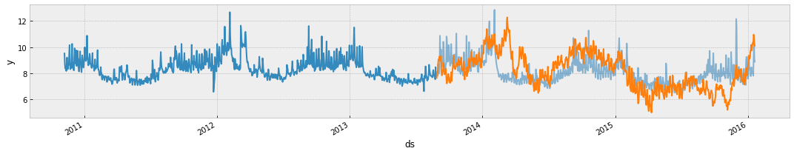
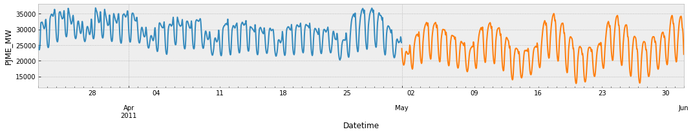

The input to this forecaster is always a dataframe with atleast two columns: datestamp and target y. The datestamp column should be of a format expected by Pandas, ideally YYYY-MM-DD for a date or YYYY-MM-DD HH:MM:SS for a timestamp. The y column must be numeric, and represents the measurement we wish to forecast.

As an example, let’s look at a time series of the hourly power consumption data from PJM's website in megawatts (MW). The CSV is available [here](here).

First we’ll import the data:

```python
import pandas as pd
from forecaster import Forecaster
```
```python
df = pd.read_csv('PJME.csv')
df.head()
```

|   |            Datetime | PJME_MW |
|--:|--------------------:|--------:|
| 0 | 2011-03-01 00:00:00 | 27845.0 |
| 1 | 2011-03-01 01:00:00 | 26516.0 |
| 2 | 2011-03-01 02:00:00 | 25968.0 |
| 3 | 2011-03-01 03:00:00 | 25927.0 |
| 4 | 2011-03-01 04:00:00 | 26225.0 |

We create the model by instantiating a new Forecaster object.

```python
model = Forecaster(
    df,
    x = 'Datetime',
    y = 'PJME_MW'
)
```

Predictions are then made on a dataframe with a column ds containing the dates for which a prediction is to be made. You can get a suitable dataframe that extends into the future a specified number of days using the helper method Forecaster.make_future_dataframe.

```python
model.make_future_dataframe(periods=744)
model.df.tail()
```

|      |            Datetime | PJME_MW |
|-----:|--------------------:|--------:|
| 2204 | 2011-05-31 20:00:00 |     NaN |
| 2205 | 2011-05-31 21:00:00 |     NaN |
| 2206 | 2011-05-31 22:00:00 |     NaN |
| 2207 | 2011-05-31 23:00:00 |     NaN |
| 2208 | 2011-06-01 00:00:00 |     NaN |

The validation method will do a validation using the available data with a 70% training size. Any settings to the forecasting procedure are passed into the method.

```python
from sklearn.linear_model import Ridge
y_valid, scores = model.validate(
    Ridge,
    seasonality = True,
    lag = True,
    plot = True
)
```

|       | Training score | Test score |
|------:|---------------:|-----------:|
| Ridge |       0.005416 |   0.104062 |



The predict method will assign each row with a missing value, a predicted value.

```python
forecast, scores = model.forecast(
    Ridge, 
    seasonality = True, 
    lag = True, 
    plot = True
)
forecast.head()
```

|       | Training score |
|------:|---------------:|
| Ridge |       0.004821 |



|   |            Datetime |      PJME_MW |
|--:|--------------------:|-------------:|
| 0 | 2011-05-01 00:00:00 | 23875.251853 |
| 1 | 2011-05-01 01:00:00 | 22007.247739 |
| 2 | 2011-05-01 02:00:00 | 20563.204068 |
| 3 | 2011-05-01 03:00:00 | 19540.168899 |
| 4 | 2011-05-01 04:00:00 | 18886.356817 |


You can plot the forecast by passing `plot = True.`