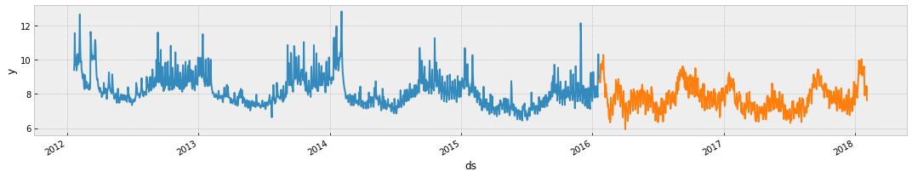

The input to this forecaster is always a dataframe with atleast two columns: datestamp and target y. The datestamp column should be of a format expected by Pandas, ideally YYYY-MM-DD for a date or YYYY-MM-DD HH:MM:SS for a timestamp. The y column must be numeric, and represents the measurement we wish to forecast.

As an example, let’s look at a time series of the hourly power consumption data from PJM's website in megawatts (MW). The CSV is available [here](here).

First we’ll import the data:

```python
import pandas as pd
from forecaster import Forecaster
```
```python
df = pd.read_csv('https://github.com/Hesbadami/Forecaster/raw/main/examples/example_wp_log_peyton_manning.csv')
df.head()
```

|   |         ds |        y |
|--:|-----------:|---------:|
| 0 | 2007-12-10 | 9.590761 |
| 1 | 2007-12-11 | 8.519590 |
| 2 | 2007-12-12 | 8.183677 |
| 3 | 2007-12-13 | 8.072467 |
| 4 | 2007-12-14 | 7.893572 |

We create the model by instantiating a new Forecaster object.

```python
model = Forecaster(
    df,
    x = 'ds',
    y = 'y'
)
```

Predictions are then made on a dataframe with a column ds containing the dates for which a prediction is to be made. You can get a suitable dataframe that extends into the future a specified number of days using the helper method Forecaster.make_future_dataframe.

```python
model.make_future_dataframe(periods=744)
model.df.tail()
```

|      |         ds |   y |
|-----:|-----------:|----:|
| 3645 | 2018-01-30 | NaN |
| 3646 | 2018-01-31 | NaN |
| 3647 | 2018-02-01 | NaN |
| 3648 | 2018-02-02 | NaN |
| 3649 | 2018-02-03 | NaN |

The validation method will do a validation using the available data with a 70% training size. Any settings to the forecasting procedure are passed into the method.

```python
from sklearn.linear_model import Ridge
y_valid, scores = model.validate(
    Ridge(),
    seasonality = True,
    lag = True,
    plot = True
)
```

|         | Training score | Test score |
|--------:|---------------:|-----------:|
| Ridge() |       0.025996 |   0.116977 |


The predict method will assign each row with a missing value, a predicted value.

```python
forecast, scores = model.predict(
    Ridge(), 
    seasonality = True, 
    lag = True, 
    plot = True
)
forecast.head()
```

|         | Training score |
|--------:|---------------:|
| Ridge() |       0.027506 |



|   |         ds |        y |
|--:|-----------:|---------:|
| 0 | 2016-01-21 | 8.761484 |
| 1 | 2016-01-22 | 8.896301 |
| 2 | 2016-01-23 | 8.670980 |
| 3 | 2016-01-24 | 8.975107 |
| 4 | 2016-01-25 | 9.741738 |


You can plot the forecast by passing `plot = True.`